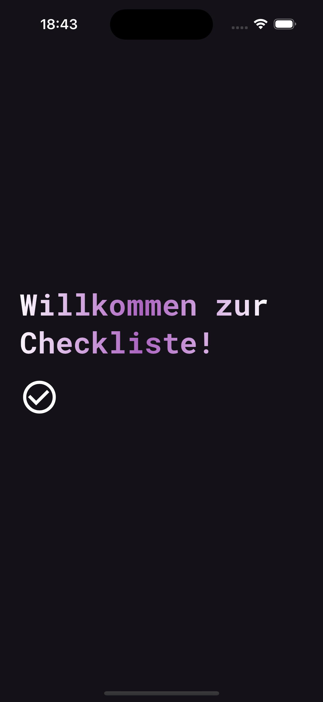
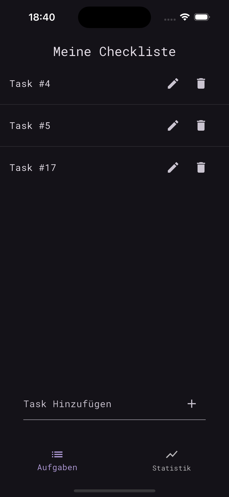
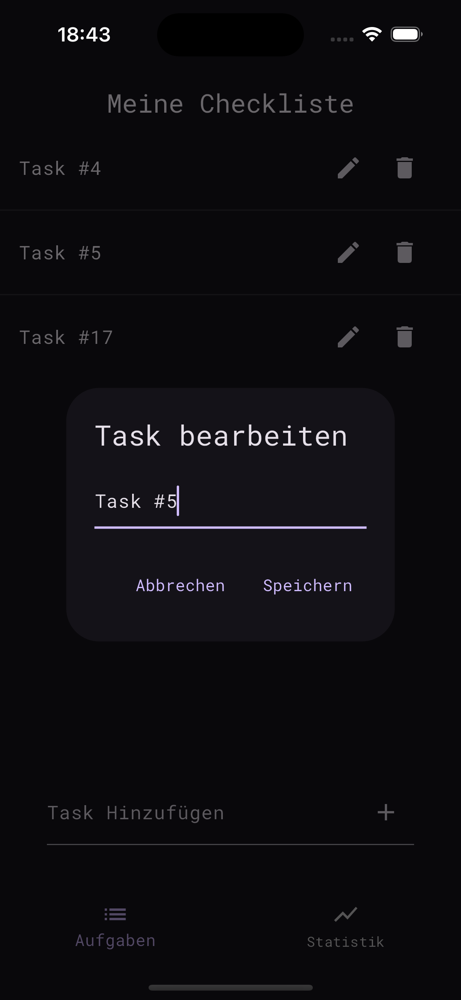
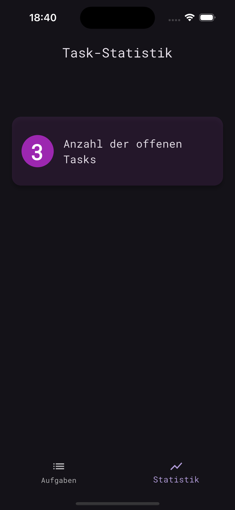

# simple_beautiful_checklist

Eine kleine, aber schöne Flutter-Checklisten-App, um das Verwenden von `SharedPreferences` zu üben.

## Aufgabe

Es soll ein `SharedPreferecesRepository` implementiert werden, der statt der `MockDatabase` verwendet wird.

## App laufen lassen

Eventuell muss `flutter pub get` oder über VSCode `Flutter: Get Packages` ausgeführt werden.
Dann kann man in der `main.dart` auf "run" klicken.

## Screenshots

Splash Screen                  |  Checklist Screen
:--------------------------------:|:-------------------------:
{width=150}  |  {width=150}

Editing a Task           |  Statistics Screen
:--------------------------------:|:-------------------------:
{widht=150}  |  {widht=150}